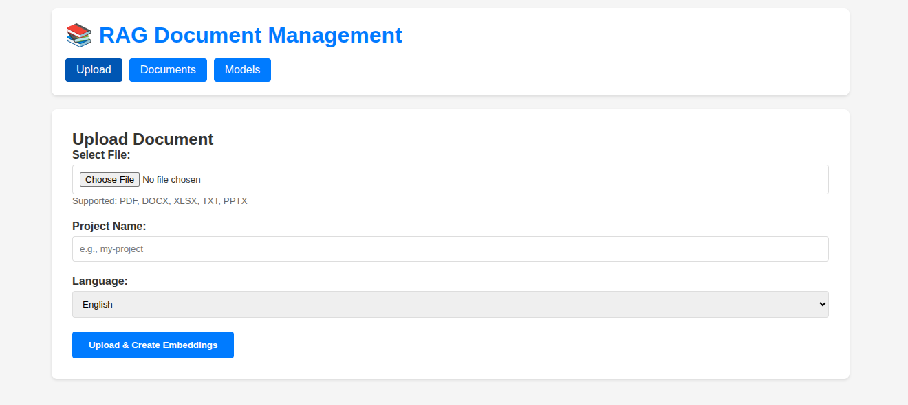

# RAG System - Retrieval Augmented Generation - RAG

A retrieval-augmented generation system with hybrid search, semantic chunking, and OCR support.

## Architecture


- **Backend** (8000): Main API, handles requests
- **RAG Service** (8001): Document processing, chunking, retrieval
- **AI Service** (8002): Embeddings and LLM inference
- **Qdrant** (6333): Vector database
- **Web UI** (3000): Open WebUI interface

## Requirements

### System Requirements

- Docker and Docker Compose
- At least 8GB RAM (16GB recommended)
- 10GB free disk space for models and data

### LLM Setup

The system uses Ollama for local LLM inference. You need to:

1. **Install Ollama** (if not already installed):
   ```bash
   curl -fsSL https://ollama.com/install.sh | sh
   ```

2. **Pull the required model**:
   ```bash
   ollama pull phi3:mini
   ```

3. **Start Ollama service**:
   ```bash
   ollama serve
   ```

   Ollama should be running on `http://localhost:11434` (default port).

### OCR Models (Optional)

If you want to use OCR for scanned PDFs, download the ONNX models to `rag/ocr/models/`:

- `ch_PP-OCRv5_mobile_det.onnx` - Text detection
- `ch_ppocr_mobile_v2.0_cls_infer.onnx` - Text classification
- `ch_PP-OCRv5_rec_mobile_infer.onnx` - Text recognition

The system will work without OCR models, but scanned PDFs won't be processed.

### Configuration

Edit `docker-compose.yml` to customize settings:

```yaml
ai-service:
  environment:
    EMBEDDING_MODEL: BAAI/bge-m3      # Embedding model
    EMBEDDING_DEVICE: cpu              # cpu or cuda
    LLM_BACKEND: ollama                # ollama, openai, or huggingface
    LLM_MODEL: phi3:mini              # Model name
    OLLAMA_BASE_URL: http://host.docker.internal:11434
```

For OpenAI or HuggingFace, update `LLM_BACKEND` and add API keys in environment variables.

## Example: Working with Invoices

Let's walk through a complete example using the sample invoices.

### Step 1: Start the Services

```bash
docker compose up -d
```

Wait for all services to be ready (check logs with `docker compose logs -f`).

### Step 2: Upload an Invoice

Upload the sample invoice to the system:

```bash
curl -X POST http://localhost:8000/v1/documents \
  -F "file=@invoices/invoice_Aaron Hawkins_4820.pdf" \
  -F "collection=invoices"
```

You should see a response with the document ID and status.

### Step 3: Query the Invoice

You can query the invoice in two ways:

#### Option A: Using the Test Script

```bash
python test_query.py
```

This will ask: "Are there any discounts or additional charges applied to Invoice #4820?"

#### Option B: Using Web UI

1. Open http://localhost:3000 in your browser
2. Start a new chat
3. Ask: "Are there any discounts or additional charges applied to Invoice #4820?"

#### Option C: Using curl

```bash
curl -X POST http://localhost:8001/query \
  -H "Content-Type: application/json" \
  -d '{
    "question": "Are there any discounts or additional charges applied to Invoice #4820?",
    "collection": "invoices",
    "include_sources": true
  }'
```



## Features

### Hybrid Search

Combines vector search (semantic) and BM25 (keyword) for better results.

Example: Searching for "machine learning" finds documents mentioning "ML", "neural networks", or "deep learning" (vector) plus exact keyword matches (BM25).

### Semantic Chunking

Splits documents intelligently:
- Respects document structure (headings, sections)
- Keeps chunks around 512 tokens for BGE-M3
- Handles CJK languages properly

Example: A 10-page PDF gets split into ~20-30 meaningful chunks, not arbitrary 500-character pieces.

### OCR Support

Extracts text from scanned PDFs and images automatically.

Example: Upload a scanned invoice → OCR extracts text → chunks and indexes it → you can search and ask questions.

