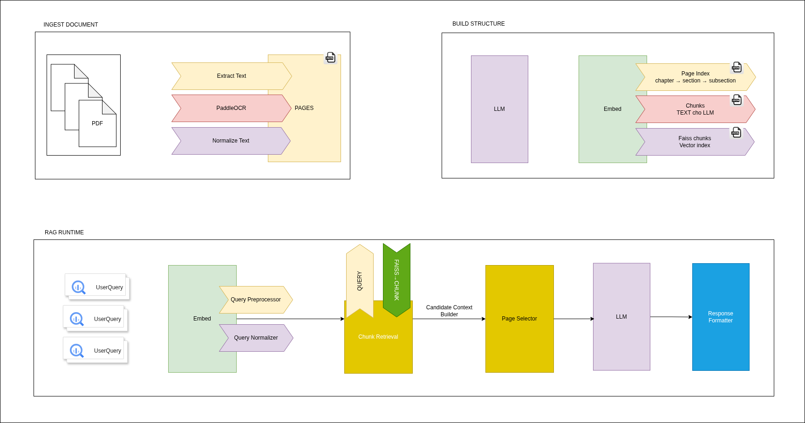

# RAG System - Retrieval Augmented Generation - RAG

A retrieval-augmented generation system with hybrid search, semantic chunking, and OCR support.

## Architecture




- **RAG Service** (8001): Document processing, chunking, retrieval
- **Web UI** (3000): Open WebUI interface

## Requirements

### System Requirements

- Docker and Docker Compose
- At least 8GB RAM (16GB recommended)
- 10GB free disk space for models and data

### LLM Setup

The system uses Ollama for local LLM inference. You need to:

1. **Install Ollama** (if not already installed):
   ```bash
   curl -fsSL https://ollama.com/install.sh | sh
   ```

2. **Pull the required model**:
   ```bash
   ollama pull phi3:mini
   ```

3. **Start Ollama service**:
   ```bash
   ollama serve
   ```

   Ollama should be running on `http://localhost:11434` (default port).

### OCR Models (Optional)

If you want to use OCR for scanned PDFs, download the ONNX models to `rag/ocr/models/`:

- `ch_PP-OCRv5_mobile_det.onnx` - Text detection
- `ch_ppocr_mobile_v2.0_cls_infer.onnx` - Text classification
- `ch_PP-OCRv5_rec_mobile_infer.onnx` - Text recognition

The system will work without OCR models, but scanned PDFs won't be processed.

## Features

### Hybrid Search

Combines vector search (semantic) and BM25 (keyword) for better results.

Example: Searching for "machine learning" finds documents mentioning "ML", "neural networks", or "deep learning" (vector) plus exact keyword matches (BM25).

### Semantic Chunking

Splits documents intelligently:
- Respects document structure (headings, sections)
- Keeps chunks around 512 tokens for BGE-M3
- Handles CJK languages properly

Example: A 10-page PDF gets split into ~20-30 meaningful chunks, not arbitrary 500-character pieces.

### OCR Support

Extracts text from scanned PDFs and images automatically.
Example: Upload a scanned invoice → OCR extracts text → chunks and indexes it → you can search and ask questions.

