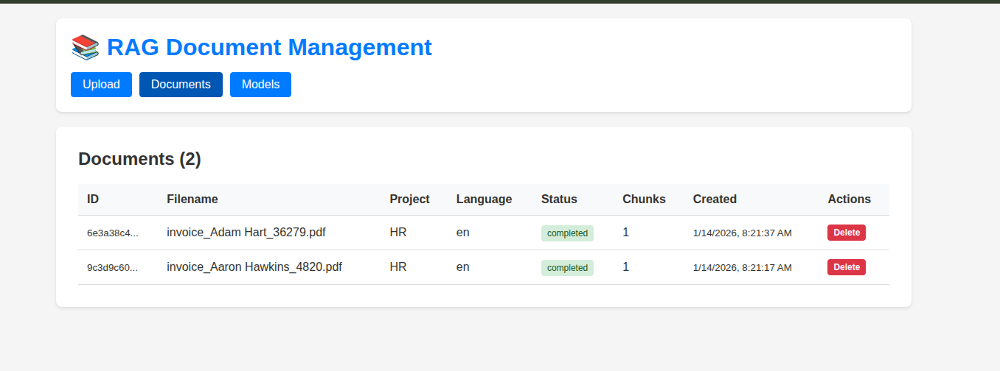

# RAG System - Retrieval Augmented Generation - RAG

A retrieval-augmented generation system with hybrid search, semantic chunking, and OCR support.

## Architecture

- **Backend** (8000): Main API, handles requests
- **RAG Service** (8001): Document processing, chunking, retrieval
- **AI Service** (8002): Embeddings and LLM inference
- **Qdrant** (6333): Vector database
- **Web UI** (3000): Open WebUI interface

## Features

### Hybrid Search

Combines vector search (semantic) and BM25 (keyword) for better results.

Example: Searching for "machine learning" finds documents mentioning "ML", "neural networks", or "deep learning" (vector) plus exact keyword matches (BM25).

### Semantic Chunking

Splits documents intelligently:
- Respects document structure (headings, sections)
- Keeps chunks around 512 tokens for BGE-M3
- Handles CJK languages properly

Example: A 10-page PDF gets split into ~20-30 meaningful chunks, not arbitrary 500-character pieces.

### OCR Support

Extracts text from scanned PDFs and images automatically.

Example: Upload a scanned invoice → OCR extracts text → chunks and indexes it → you can search and ask questions.

